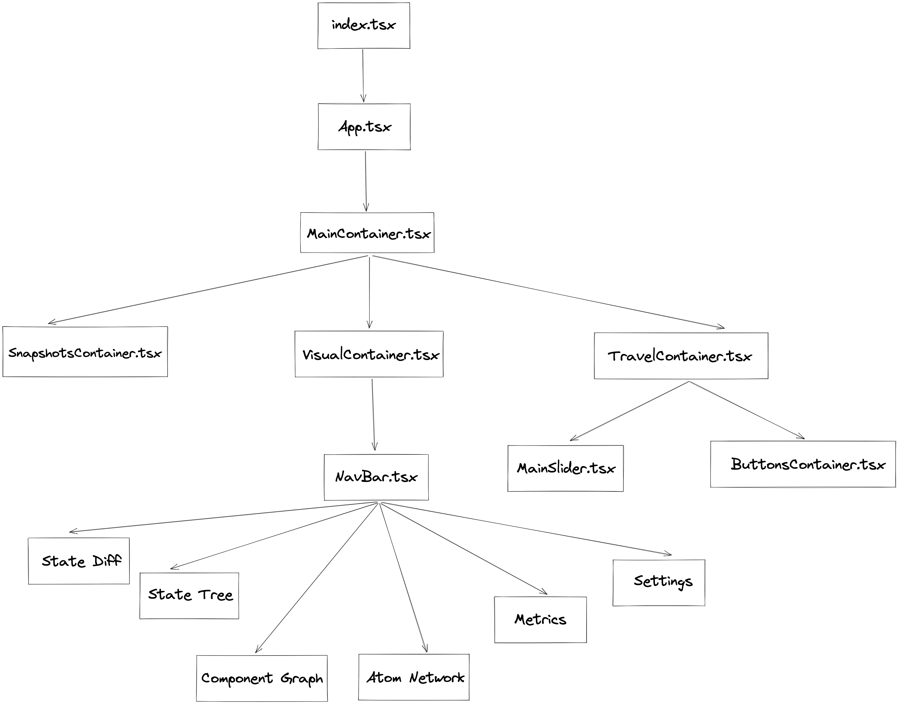

# Developer README

## Brief
Though Recoil.js is still in the experimental state, it has proved its ability and catched a tremendous amount of attentions from experience developers for the past three years. We created Recoilize with one great mission in mind - providing a helpful tool so the developers can make an easy transition to Recoil.js and making the debugging process more effective. Recoilize is an open source product that is maintained and iterated constantly, and we're always welcome developers who are interested in it. Getting on board and understanding the codebase are never easy, so here are some useful tips and information that will help you get started quickly.

## File Structure
The scr folder contains Recoilize's source code - frontend and chrome extension.

```
src/
├── app/                      # Frontend code
│   ├── components/           # React components
│   ├── Containers/           # More React components
│   ├── state-management/     # Redux Toolkit Slices
│   ├── utils/                # Helper Functions  
│   └── index.tsx             # Starting point for root App component 
│
├── types/                           
│   └── index.d.ts            #
│
├── extension/                # Chrome Extension code
│   ├── build/                # Destination for bundles and manifest.json (Chrome config file)
│   │                         #
│   ├── background.js         # Chrome Background Script
│   └── contentScript.ts      # Chrome Content Script
└──
```
Here is an in-depth view of the app's components:



## Diagramming
If there's an update in the file structure, we suggest using [excalidraw](https://excalidraw.com/)

## Future Features and Possible Improvements
- The Flame Graph has a bug. If you take a look at the it, you'll see graphs are slowing expanding to the left. This bug does not exist in other graph component such as Ranked Graph and Comparison Graph.
- Optimizing Time Travel Algorithm. The Time Travel Algorithm is working perfectly. However, we believe that it can be better by implementing a better algorithm (or different approaches). Please note that there's no right or wrong approaches, and everyone is welcome to try new ideas.
- UI/UX improvement. The UI/UX aspect definitely has room for improvement. Please feel free to play around with the app to get some ideas. For example, look at the component graph, atom network, graphs (flame, ranked, comparison).
- Testing is an important aspect, and we believe in TDD (Test Driven Development). However, due to time constraint and the limitation of resources, Recoilize is missing the testing part. Since testing has so much potential to improve, we strongly recommend developers who love testing get started as soon as you get onboard.
- Documentations - Documentations often get neglected since developers usually focus on writing code to improve features. However, at Recoilize, we believe that documenting is one of the most important tasks. Why? Because it's helpful not only for you, your teammates but it can also be valuable for future developers who interested in Recoilize. So if you love Recoilize, take good care of it by writing good documentations.
- Containerization - Have you ever wondered why the app that you made ran perfectly on your computer but it couldn't run on other's computers. That is a common problem that software engineers often encounter. We can solve this by containerize our app, and `Docker` is a good candidate for this task.